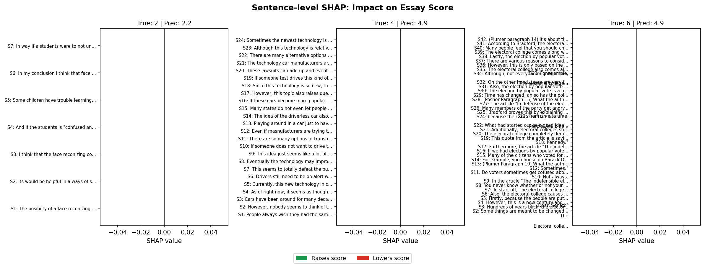
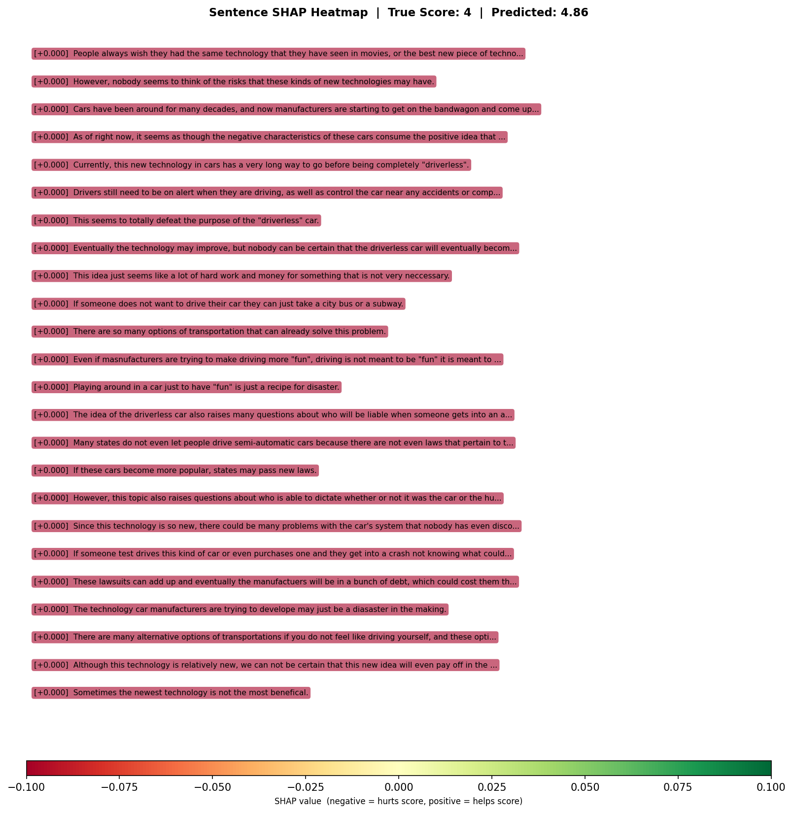

# Privacy-Aware Automated Essay Scorer

A two-stage NLP pipeline that detects and redacts PII from student essays,
then scores the (redacted or edited) essay on a 1–6 holistic rubric with
sentence-level importance highlighting — wrapped in an interactive Streamlit
app that lets the user review, accept, or hand-edit the PII redactions
before scoring.

**Live demo:** [https://privacy-aware-essay-scorer.streamlit.app/](https://privacy-aware-essay-scorer.streamlit.app/)

---

## Why redact before scoring?

In production educational AI, essays must be anonymised before automated
scoring to prevent models from learning to associate student identity signals
(names, emails, school IDs) with score labels. This pipeline reflects that
reality: Stage 1 detects and redacts PII, Stage 2 scores what remains.

---

## How the app works

1. **Paste an essay** and click "Detect PII."
2. **Review** — flagged PII spans are highlighted inline in the essay text,
   with a checkbox per entity so you can opt out of redacting specific
   tokens. From here you can either:
   - **Redact Automatically & Score** — apply the selected redactions and
     move straight to scoring, or
   - **Edit Essay Manually** — open the essay in an editable text box to
     remove or rewrite anything yourself, then either re-run PII detection
     on the edited text or send it straight to scoring.
3. **Score** — the (redacted or edited) essay is scored 1–6, shown as a
   circular gauge with a star rating, alongside:
   - **Confidence and possible range** — a heuristic derived from how close
     the raw regression output is to the nearest integer (e.g. raw `4.9`
     → predicted `5`, confidence `80%`, possible range `4–5`). This is *not*
     a calibrated probability — it's a transparency aid, labelled as such
     in the UI.
   - **Essay statistics** — word count, sentence count, Flesch-Kincaid
     readability grade, grammar-error count (optional, see Limitations),
     and number of PII entities redacted.
   - **Sentence Importance (Leave-One-Out)** — each sentence shown in a
     colour-coded card (green = raises score, red = lowers score, grey =
     neutral) with the exact delta and direction.

---

## Results

| Stage | Model | Metric | Value |
|-------|-------|--------|-------|
| PII Detection | DeBERTa-v3-base (NER) | Entity F1 | **0.9048** |
| PII Detection | — | Precision | 0.8498 |
| PII Detection | — | Recall | 0.9673 |
| Essay Scoring | DeBERTa-v3-base (regression) | OOF QWK (5-fold) | **0.7926** |
| Essay Scoring | — | Fold 1 (used in app) | QWK 0.7650 |

---

## Sentence Importance (Leave-One-Out)

**Summary across 3 validation essays:**



Each bar shows a sentence's leave-one-out importance score: how much the
predicted score drops when that sentence is removed. Positive values (green)
indicate sentences that contribute positively to the score. Negative values
(red) indicate sentences that lower the prediction. This is not SHAP — it is
a direct re-scoring approach with no approximation assumptions.

**Single-essay sentence heatmap:**



Green passages are the strongest positive contributors to the predicted score.
Red passages lower the predicted score. The Streamlit app renders this same
breakdown interactively, per-sentence, after scoring.

---

## Reproduction

```bash
git clone https://github.com/yashghatol/edtech-nlp-pipeline
cd edtech-nlp-pipeline
pip install -r requirements.txt
streamlit run app/app.py
```

Notes:
- Model weights are hosted on public HuggingFace Hub repos and download
  automatically on first run (~700 MB total, ~2 minutes).
- `requirements.txt` installs the spaCy `en_core_web_sm` model directly via
  a pinned wheel URL (Streamlit Community Cloud's `uv`-based build pipeline
  does not reliably execute `setup.sh`, so `spacy download` cannot be relied
  on at deploy time).
- `numpy<2.0` is pinned — spaCy 3.7.4's `thinc` backend has compiled
  extensions that are ABI-incompatible with NumPy 2.x.

---

## Experiment Log

Full training history with all hyperparameter decisions:
[outputs/experiment_log.csv](outputs/experiment_log.csv)

---

## Known Limitations

- **`NAME_STUDENT` recall ≈ 0 at inference.** Despite training, the PII
  model assigns near-zero probability to `B-/I-NAME_STUDENT` on clearly
  named text (e.g. "Hi, I'm Sarah Johnson"), even though `B-EMAIL` and other
  categories work correctly. This is the most common PII category in real
  essays, so the "redaction" framing is scoped honestly: the app reliably
  redacts emails, usernames, IDs, URLs, and addresses, but **does not
  reliably detect student names**. The PII review screen lets users manually
  remove names themselves via the "Edit Essay Manually" flow as a practical
  mitigation. Root cause (training data / label construction) not
  diagnosed further due to time budget — flagged for future work.
- **Distribution shift:** Stage 2 was trained on raw essays but scores
  redacted or user-edited essays at inference. `[REDACTED]` tokens are
  handled gracefully by DeBERTa's subword tokeniser, but scores are
  approximate.
- **STREET_ADDRESS F1 = 0.00:** Only 2 training examples — effectively
  unlearnable. Documented, not fixed.
- **USERNAME F1 = 0.67:** Only 6 training examples — fragile. A high
  confidence floor (0.90) suppresses over-firing at inference.
- **Single fold at inference:** The app uses fold 1 only (QWK 0.7650).
  An ensemble of all 5 folds would improve by 1–2 QWK points but adds
  ~20s latency — unacceptable for interactive use.
- **Confidence/range is a heuristic, not a calibrated probability.** It is
  derived solely from the regression output's distance to the nearest
  integer and should be read as a rough transparency signal, not a
  statistical guarantee.
- **Grammar-error count is optional.** It requires `language_tool_python`
  (which bundles a Java runtime and downloads ~200MB on first use) and is
  not installed by default to keep the Streamlit Cloud deployment within
  memory limits. The app shows "N/A" gracefully when unavailable.
- **Out-of-distribution essays score conservatively.** The essay model was
  trained on the AES 2.0 / PERSUADE-style argumentative essay corpus, whose
  score distribution is centred on 3–4; essays on different topics/genres
  tend to regress toward the mean. A known-6 essay from the training
  distribution scores ~4.9 through the app, confirming the model and
  pipeline are calibrated correctly on in-distribution text.

---

## What I'd Do Next

1. **Diagnose and fix `NAME_STUDENT` recall.** Check the training label
   distribution for `B-/I-NAME_STUDENT` counts — if near-zero, the bug is
   in BIO-label construction from the source dataset, not the model
   architecture. Given names are the most common PII category, this is the
   single highest-impact fix.
2. **Eliminate distribution shift:** Retrain Stage 2 on PII-redacted essays
   using Stage 1 out-of-fold predictions to generate the redacted training
   corpus.
3. **Replace LOO with integrated gradients:** A theoretically grounded
   attribution method that is faster than LOO for long essays (one backward
   pass vs. N forward passes).
4. **Augment rare labels:** Synthesise STREET_ADDRESS and USERNAME training
   examples via rule-based generation to move their F1 off zero and 0.67
   respectively.
5. **Calibrate confidence properly:** Replace the distance-to-nearest-integer
   heuristic with a real calibration approach (e.g. ensemble variance across
   folds, or conformal prediction intervals from OOF residuals).